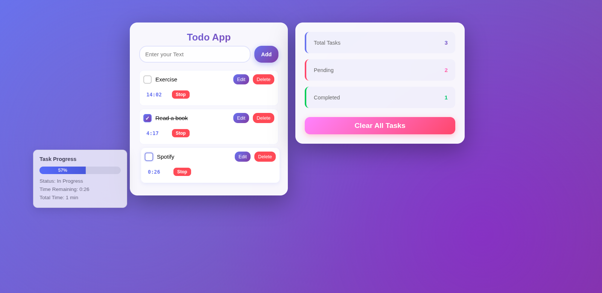

# 📝 Advanced Todo Application with Timer & Progress Tracking

## 🌟 Overview

This is a feature-rich Todo application built with HTML, CSS, and Vanilla JavaScript. It combines task management with built-in timers and visual progress tracking, making it perfect for time-boxed productivity and task completion monitoring.

The application demonstrates modern JavaScript best practices while maintaining clean, readable code with clear separation of concerns between structure (HTML), styling (CSS), and logic (JavaScript).

---

## 🎯 Purpose of the Project

The primary purpose of this project is to strengthen understanding of JavaScript fundamentals through a real-world, production-ready application. This goes beyond basic todo apps by incorporating:

- **State Management**: Complex state handling with timer management
- **Real-time Updates**: Live countdown timers with interval management
- **Data Persistence**: LocalStorage integration for seamless user experience
- **Interactive UI**: Hover effects with dynamic progress calculations
- **Event-driven Architecture**: Efficient event handling across multiple user interactions

This project demonstrates how to build a complete, professional application using only vanilla JavaScript—no frameworks required.

---

## 👥 Who Can Benefit From This Project

This project is especially valuable for:

- **JavaScript Learners** seeking a comprehensive, real-world example beyond basic tutorials
- **Frontend Developers** practicing DOM manipulation, state management, and timer handling
- **Portfolio Builders** looking for an impressive, functional project to showcase
- **Interview Candidates** demonstrating practical JavaScript skills
- **Educators** needing a teaching resource for intermediate JavaScript concepts
- **Productivity Enthusiasts** who want a customizable time-tracking todo app

---

## ✨ Features

### Core Task Management

- ✅ Add new tasks with a clean, intuitive interface
- ✏️ Edit tasks inline (no dialog prompts)
- 🗑️ Delete individual tasks
- ☑️ Mark tasks as completed with visual feedback
- 🧹 Clear all tasks with a single button
- 📊 Real-time statistics (total, pending, completed tasks)

### Timer & Progress Tracking (NEW)

- ⏱️ **Individual Task Timers**: Set custom timers (in minutes) for each task
- ▶️ **Start/Stop/Reset Controls**: Full timer control with visual feedback
- ⏰ **Live Countdown**: Real-time countdown display that persists across page reloads
- 📈 **Progress Visualization**: Hover over any task to see:
  - Dynamic progress bar calculated from timer completion
  - Completion percentage (0-100%)
  - Task status and remaining time
  - Total time allocated

### Data & Performance

- 💾 **LocalStorage Persistence**: All tasks and timer states saved automatically
- 🔄 **Auto-restore on Reload**: Tasks and running timers resume exactly where you left off
- ⌨️ **Keyboard Support**: Press Enter to add tasks or save edits
- 📱 **Responsive Design**: Works seamlessly on desktop and mobile devices

---

## 🛠️ Technologies Used

- **HTML5** - Semantic structure and accessibility
- **CSS3** - Modern styling with flexbox, transitions, and responsive design
- **Vanilla JavaScript (ES6+)** - Core logic, DOM manipulation, and state management
- **LocalStorage API** - Client-side data persistence
- **Interval API** - Real-time timer countdown functionality

---

## 📸 Screenshot



_A modern, clean interface with task timers and hover-activated progress tracking_

---

## 📁 Project Structure

```
todo-app/
│
├── index.html          # Main HTML structure
├── style.css           # Core styling (layout, components, timer UI)
├── stats.css           # Statistics section styling
├── index.js            # Application logic (state, timers, DOM)
└── README.md           # Project documentation
```

---

## ⚙️ How the Application Works

### State Management

Each task is stored as an object containing:

```javascript
{
  text: "Task description",
  completed: false,
  timerSet: false,
  timerRunning: false,
  timerMinutes: 25,
  timerSeconds: 1500
}
```

All tasks are maintained in a centralized array representing the application state. Every action (add, edit, complete, delete, timer update) triggers a state update, UI re-render, and localStorage synchronization.

### Timer System

- Timers run using JavaScript's `setInterval()`
- Each timer has its own interval stored in a `timerIntervals` object
- Timer state persists to localStorage every second
- On page reload, running timers automatically resume
- When a timer reaches zero, it displays completion status

### Progress Calculation

The hover tooltip calculates progress dynamically:

- **No Timer Set**: 0% progress
- **Timer Active**: `(elapsed time / total time) × 100`
- **Task Completed**: 100% progress

---

## 📊 Task Statistics

The application provides real-time metrics:

- **Total Tasks**: Complete count of all tasks
- **Pending Tasks**: Tasks not yet marked complete
- **Completed Tasks**: Tasks marked as done

Statistics recalculate instantly on every state change, ensuring accuracy.

---

## 🎓 Learning Outcomes

By studying and building this project, developers gain hands-on experience with:

### JavaScript Fundamentals

- Complex state management without frameworks
- Array methods (`push`, `splice`, `filter`, `forEach`, `map`)
- Object manipulation and property management
- Closure usage for maintaining timer references

### DOM Manipulation

- Dynamic element creation and removal
- Event listener management and cleanup
- CSS class manipulation for state changes
- Inline editing without browser prompts

### Asynchronous JavaScript

- `setInterval` for real-time updates
- Proper cleanup of intervals to prevent memory leaks
- Managing multiple concurrent timers

### Browser APIs

- LocalStorage for data persistence
- JSON serialization and deserialization
- Session state management

### Code Architecture

- Separation of concerns (rendering, state, persistence)
- Reusable function design
- Clean, maintainable code structure

---

## 🚀 Installation & Usage

1. **Clone or Download** the repository
2. **Open `index.html`** in any modern browser
3. **Start Using**:
   - Type a task and press Enter or click "Add"
   - Set a timer by entering minutes and clicking "Set"
   - Start the timer and watch it countdown
   - Hover over tasks to see progress
   - Mark tasks complete when finished

No build process, no dependencies—just open and use!

---

## 🔮 Possible Improvements & Extensions

The project can be enhanced further with:

### Features

- 🎨 **Dark Mode Toggle** with theme persistence
- 🔍 **Task Filters** (All, Active, Completed)
- ↩️ **Undo/Redo Functionality** for deleted tasks
- 🏷️ **Task Categories or Tags** for organization
- 🔔 **Desktop Notifications** when timers complete
- 📅 **Due Dates** and calendar integration
- 🔊 **Sound Alerts** for timer completion
- 📤 **Export/Import** tasks as JSON

### Technical Enhancements

- 🎭 **Animations** for smoother task interactions
- ♿ **Enhanced Accessibility** (ARIA labels, screen reader support)
- 🎯 **Drag-and-drop** for task reordering
- 🌐 **PWA Support** for offline functionality
- ☁️ **Cloud Sync** with backend integration

---

## 🔑 Key Code Highlights

### Timer Management

```javascript
// Efficient timer cleanup on deletion
if (timerIntervals[index]) {
  clearInterval(timerIntervals[index]);
  delete timerIntervals[index];
}
```

### Progress Calculation

```javascript
const totalSeconds = todo.timerMinutes * 60;
const elapsedSeconds = totalSeconds - todo.timerSeconds;
const percentage = Math.round((elapsedSeconds / totalSeconds) * 100);
```

### State Persistence

```javascript
function update() {
  saveTodos(); // Persist to localStorage
  render(); // Update UI
  progress(); // Recalculate stats
}
```

---

## 📝 Code Quality & Best Practices

This project demonstrates:

- ✅ Clean, readable variable naming
- ✅ Consistent code formatting
- ✅ Proper event listener cleanup
- ✅ Memory leak prevention (interval cleanup)
- ✅ Separation of concerns
- ✅ Single responsibility functions
- ✅ DRY (Don't Repeat Yourself) principles

---

## 🤝 Contributing

Feel free to fork this project and submit pull requests for:

- Bug fixes
- New features
- Performance improvements
- Documentation enhancements

---

## 📄 License

This project is open source and available for educational and personal use.

---

## 👨‍💻 Author

**Adnan Anjum**

_Building practical JavaScript applications to demonstrate real-world development skills_

---

## 🏷️ Keywords

`javascript` `todo-app` `timer` `productivity` `vanilla-js` `localstorage` `dom-manipulation` `state-management` `portfolio-project` `beginner-friendly` `es6` `frontend-development` `time-tracking` `task-management` `progress-tracker`

---

## ⭐ If You Found This Helpful

Consider giving this project a star ⭐ and sharing it with others learning JavaScript!

---

_Last Updated: January 2026_
